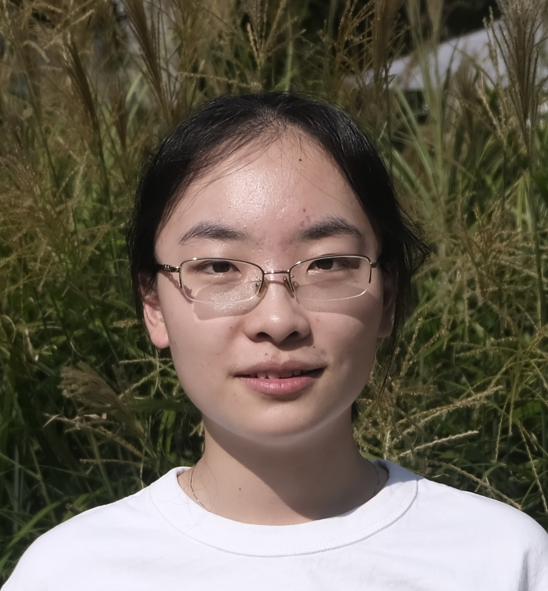
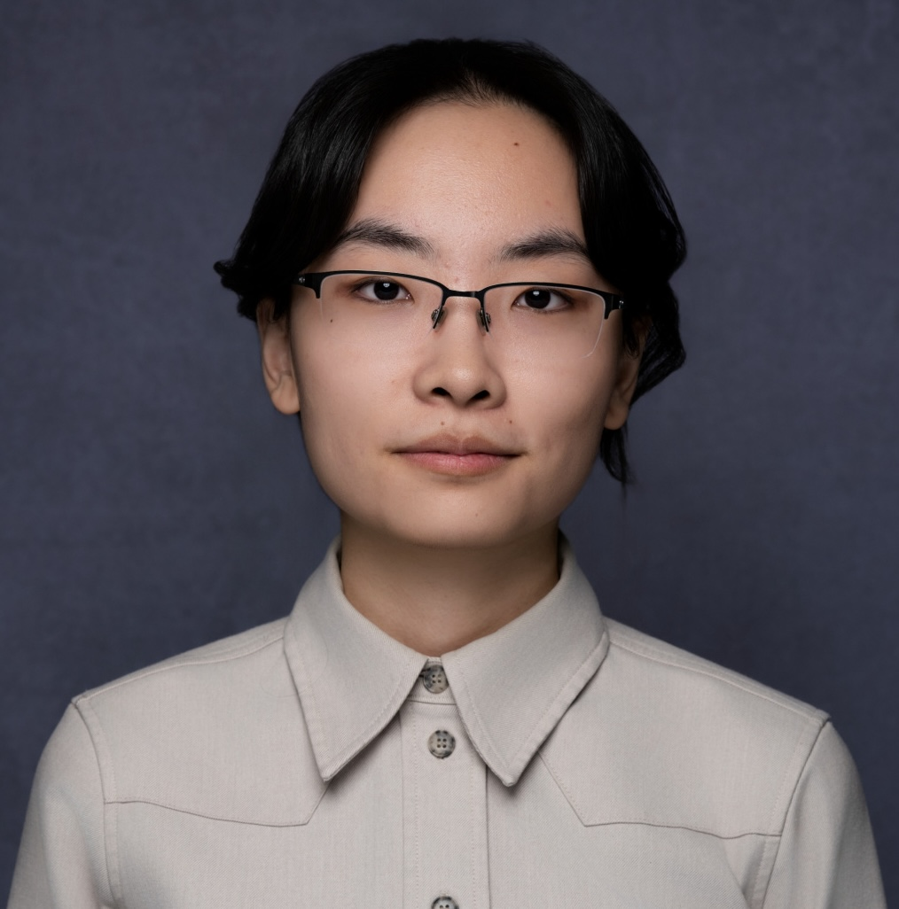

---
# Feel free to add content and custom Front Matter to this file.
# To modify the layout, see https://jekyllrb.com/docs/themes/#overriding-theme-defaults

layout: home
---

<!-- 

    

        
    

    

            
Yuqing Wang

            
yq.wang@berkeley.edu

            
<a href="CV-4.pdf">CV</a>
 and 
<a href="https://scholar.google.com/citations?user=c7Bi9RUAAAAJ&hl=en"> Google Scholar</a> 

    

 -->

<section class="profile-card">
  
  

    <h1 class="profile-name">Yuqing Wang</h1>
    
ywan1050@jh.edu

    
<a href="CV-4.pdf">CV</a>·<a href="https://scholar.google.com/citations?user=c7Bi9RUAAAAJ&hl=en">Google Scholar</a>

  

</section>

I am a postdoc in the AMS department at JHU. Before that, I was a Research Fellow at the Simons Institute at UC Berkeley for the [MPG program](https://simons.berkeley.edu/programs/modern-paradigms-generalization) in fall 2024. I obtained my PhD in Mathematics at Georgia Institute of Technology, advised by Prof. [Molei Tao](https://mtao8.math.gatech.edu).

I am currently on the job market.

# Research

I am interested in developing the mathematical foundations of deep learning. My research centers on characterizing training dynamics, combining tools from optimization, dynamical systems, computational math, and analysis. 

General theoretical tools for deep learning:

- Optimization: 
  - [Convergence of Gradient Descent for General Neural Network Architectures Beyond the NTK Regime](https://arxiv.org/pdf/2606.23364) 
- Generalization: 
  - [A Theoretical Analysis of Generalization Dynamics in Neural Networks under Gradient Descent with Weight Decay](https://arxiv.org/pdf/2609.07755)  _with Ioannis G. Kevrekidis, Mikhail Belkin_ 

Specific learning mechanisms, models, and data:

- Implicit biases of large learning rates:
  - [Good regularity creates large learning rate implicit biases: edge of stability, balancing, and catapult](http://jmlr.org/papers/volume26/23-1691/23-1691.pdf)  _with Zhenghao Xu, Tuo Zhao, Molei Tao_
  - [Large Learning Rate Tames Homogeneity: Convergence and Balancing Effect](https://arxiv.org/pdf/2110.03677.pdf)  _with Minshuo Chen, Tuo Zhao, Molei Tao_
- Model designs:
  - [Evaluating the design space of diffusion-based generative models](https://arxiv.org/pdf/2406.12839)  _with Ye He, Molei Tao_
  - [Why Do Deep Residual Networks Generalize Better than Deep Feedforward Networks? — A Neural Tangent Kernel Perspective](https://arxiv.org/pdf/2002.06262.pdf)  _with Kaixuan Huang, Molei Tao, Tuo Zhao_
- Data:
  - [Data Uniformity Improves Training Efficiency and More, with a Convergence Framework Beyond the NTK Regime]()  _with Shangding Gu_

<!-- I am currently also interested in large language models and diffusion models. -->

<!-- Specifically, my work includes studying the effects of the following: -->

<!-- - Training dynamics
  - Large learning rate: \
    [Good regularity creates large learning rate implicit biases: edge of stability, balancing, and catapult](http://jmlr.org/papers/volume26/23-1691/23-1691.pdf)  _with Zhenghao Xu, Tuo Zhao, Molei Tao_\
    [Large Learning Rate Tames Homogeneity: Convergence and Balancing Effect](https://arxiv.org/pdf/2110.03677.pdf)  _with Minshuo Chen, Tuo Zhao, Molei Tao_
  - Regular learning rate (for a family of neural network architectures): \
    [Convergence of Gradient Descent for General Neural Network Architectures Beyond the NTK Regime](https://arxiv.org/pdf/2606.23364) 
  - Infinitesimal learning rate (gradient flow/NTK regime), and other hyperparameters in diffusion model: \
    [Evaluating the design space of diffusion-based generative models](https://arxiv.org/pdf/2406.12839)  _with Ye He, Molei Tao_

- Data\
  [Data Uniformity Improves Training Efficiency and More, with a Convergence Framework Beyond the NTK Regime]()  _with Shangding Gu_
- Architecture\
  [Why Do Deep Residual Networks Generalize Better than Deep Feedforward Networks? — A Neural Tangent Kernel Perspective](https://arxiv.org/pdf/2002.06262.pdf)  _with Kaixuan Huang, Molei Tao, Tuo Zhao_ -->

# Preprints and Publications

  <article class="publication">
    <a class="publication-title" href="https://arxiv.org/pdf/2609.07755">A Theoretical Analysis of Generalization Dynamics in Neural Networks under Gradient Descent with Weight Decay</a>
    
<strong>Yuqing Wang</strong>, Ioannis G. Kevrekidis, Mikhail Belkin

    
Preprint

  </article>
  <article class="publication">
    <a class="publication-title" href="https://arxiv.org/pdf/2606.23364">Convergence of Gradient Descent for General Neural Network Architectures Beyond the NTK Regime</a>
    
<strong>Yuqing Wang</strong>

    
Preprint

  </article>
  <article class="publication">
    <a class="publication-title" href="">Data Uniformity Improves Training Efficiency and More, with a Convergence Framework Beyond the NTK Regime</a>
    
Shangding Gu, <strong>Yuqing Wang</strong>

    
Preprint

  </article>
  <article class="publication">
    <a class="publication-title" href="https://arxiv.org/pdf/2406.12839">Evaluating the design space of diffusion-based generative models</a>
    
<strong>Yuqing Wang</strong>, Ye He, Molei Tao

    
NeurIPS 2024

  </article>
  <article class="publication">
    <a class="publication-title" href="https://arxiv.org/pdf/2410.09640">Provable Acceleration of Nesterov’s Accelerated Gradient for Rectangular Matrix Factorization and Linear Neural Networks</a>
    
Zhenghao Xu, <strong>Yuqing Wang</strong>, Tuo Zhao, Rachel Ward, Molei Tao

    
NeurIPS 2024

  </article>
  <article class="publication">
    <a class="publication-title" href="http://jmlr.org/papers/volume26/23-1691/23-1691.pdf">Good regularity creates large learning rate implicit biases: edge of stability, balancing, and catapult</a>
    
<strong>Yuqing Wang</strong>, Zhenghao Xu, Tuo Zhao, Molei Tao

    
JMLR

  </article>
  <article class="publication">
    <a class="publication-title" href="https://ieeexplore.ieee.org/document/10147896">Markov Chain Monte Carlo for Gaussian: A Linear Control Perspective</a>
    
Bo Yuan, Jiaojiao Fan, <strong>Yuqing Wang</strong>, Molei Tao, Yongxin Chen

    
IEEE Control Systems Letters 2023

  </article>
  <article class="publication">
    <a class="publication-title" href="https://arxiv.org/pdf/2205.14173.pdf">Momentum Stiefel Optimizer, with Applications to Suitably-Orthogonal Attention, and Optimal Transport</a>
    
Lingkai Kong, <strong>Yuqing Wang</strong>, Molei Tao

    
ICLR 2023

  </article>
  <article class="publication">
    <a class="publication-title" href="https://arxiv.org/pdf/2110.03677.pdf">Large Learning Rate Tames Homogeneity: Convergence and Balancing Effect</a>
    
<strong>Yuqing Wang</strong>, Minshuo Chen, Tuo Zhao, Molei Tao

    
ICLR 2022

  </article>
  <article class="publication">
    <a class="publication-title" href="https://arxiv.org/pdf/2002.06262.pdf">Why Do Deep Residual Networks Generalize Better than Deep Feedforward Networks? — A Neural Tangent Kernel Perspective</a>
    
Kaixuan Huang*, <strong>Yuqing Wang</strong>*, Molei Tao, Tuo Zhao (*Equal contribution)

    
NeurIPS 2020

  </article>

# Recent talks
- 01/2026: MPG reunion workshop, Simons Institute
- 01/2026: JMM
- 11/2025: SIAM NNP
- 07/2025: [Optimization Meets Generative AI: Insights and New Designs](https://iccopt2025usc.sched.com/event/1ePvG/parallel-sessions-10d-optimization-meets-generative-ai-insights-and-new-designs), International Conference on Continuous Optimization (ICCOPT)
- 05/2025: [Math Machine Learning seminar](https://www.mis.mpg.de/events/series/math-machine-learning-seminar-mpi-mis-ucla), MPI MiS + UCLA
- 05/2025: [Dynamical Systems for Machine Learning (MS141)](https://meetings.siam.org/sess/dsp_programsess.cfm?SESSIONCODE=82755), SIAM Conference on Applications of Dynamical Systems (DS25)
- 04/2025: [CMX seminar](https://cmx.caltech.edu), Caltech
- 04/2025: AMS postdoc seminar, JHU

# Teaching
Instructor in AMS department, JHU:
- EN 553.432 Bayesian Statistics\
    Fall 2025, Fall 2026
- EN 553.361 Introduction to Optimization I\
    Spring 2025, Spring 2026

Teaching Assistant in School of Mathematics, Georgia Tech:
- MATH 2552 Differential Equation  
    Fall 2018, Spring 2019, Fall 2019, Fall 2020, Spring 2021, Spring 2022, Spring 2023, Fall 2023
- MATH 2550 Introduction to Multivariable Calculus \
    Summer 2019, Summer 2024
- MATH 2551 Multivariable Calculus \
    Spring 2020
